# LHCb VELO Toy Model - Flow Diagrams

This document contains Mermaid diagrams showing the data flow, architecture, and control flow of the LHCb VELO Toy Model package.

---

## Table of Contents

1. [High-Level Architecture](#high-level-architecture)
2. [Data Flow: Event Generation to Validation](#data-flow-event-generation-to-validation)
3. [Class Hierarchy](#class-hierarchy)
4. [Module Dependency Graph](#module-dependency-graph)
5. [Event Generation Flow](#event-generation-flow)
6. [Hamiltonian Construction Flow](#hamiltonian-construction-flow)
7. [Quantum Algorithm Flow](#quantum-algorithm-flow)
8. [Validation Flow](#validation-flow)
9. [Sequence Diagrams](#sequence-diagrams)

---

## High-Level Architecture

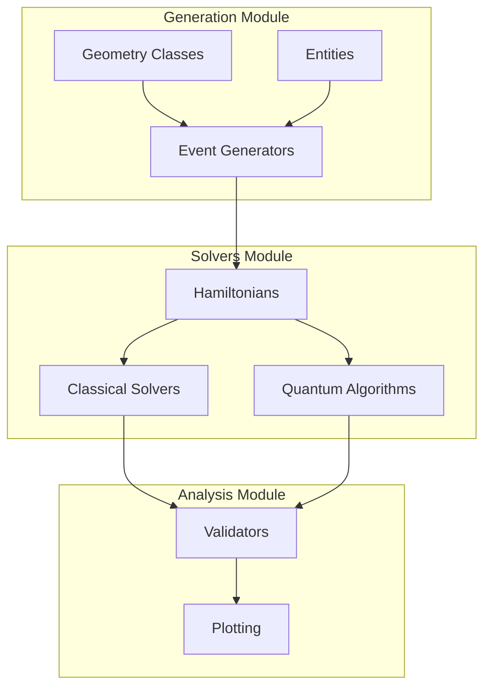

---

## Data Flow: Event Generation to Validation

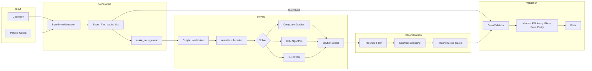

---

## Class Hierarchy

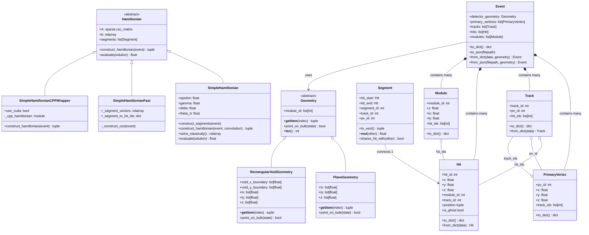

---

## Module Dependency Graph

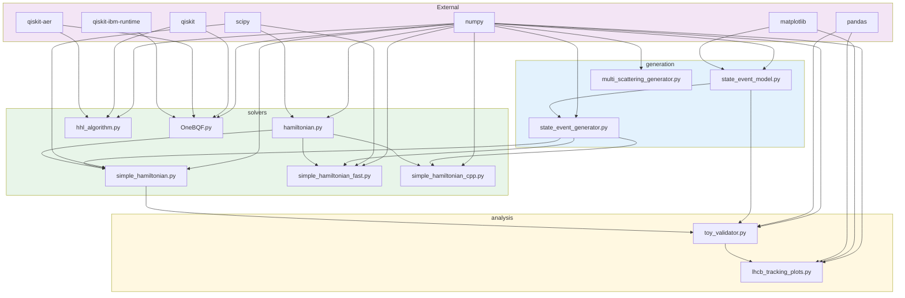

---

## Event Generation Flow

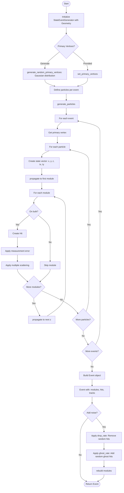

---

## Hamiltonian Construction Flow

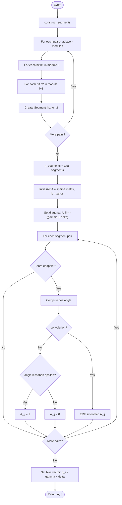

---

## Quantum Algorithm Flow

### HHL Algorithm

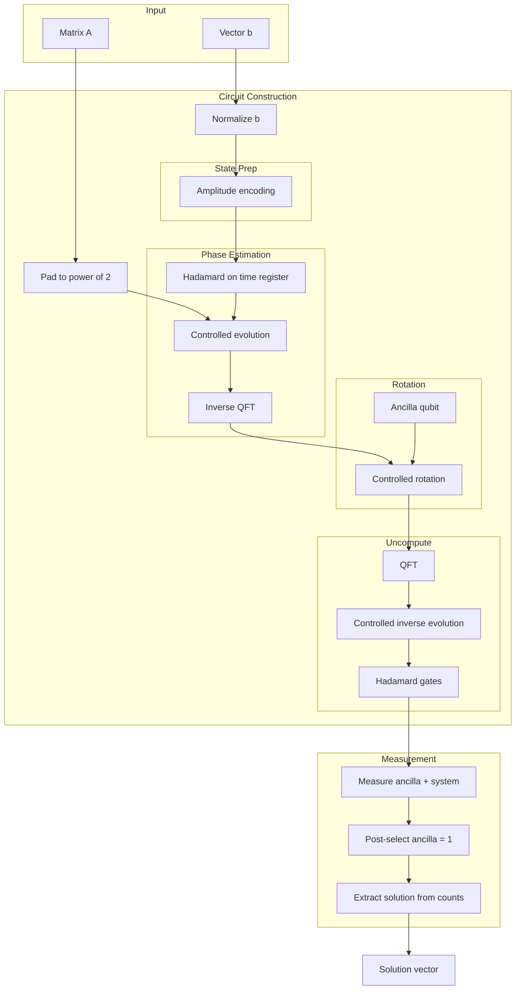

### 1-Bit Quantum Filter (OneBQF)

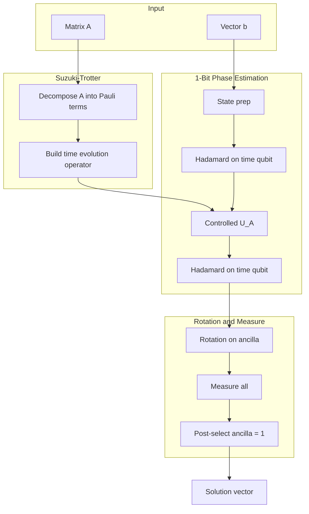

---

## Validation Flow (Non-Greedy Matching)

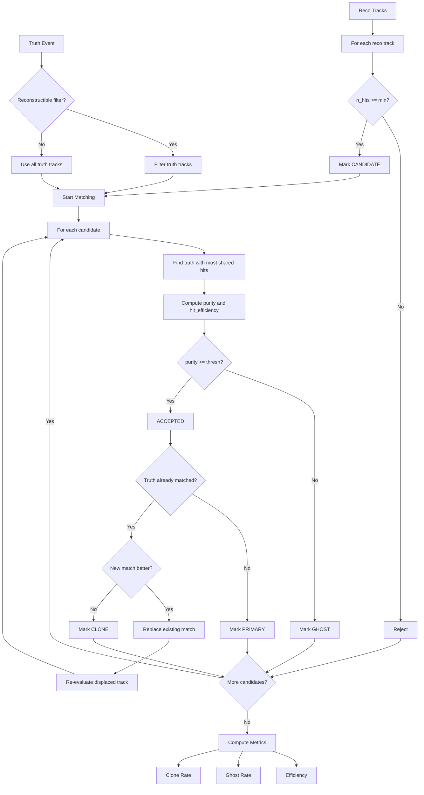

**Non-Greedy Algorithm:**
- When a truth track is already matched, compare match quality
- If new match is better, replace existing and re-evaluate displaced track
- This ensures globally optimal matching, not first-come-first-served

---

## Sequence Diagrams

### Full Reconstruction Pipeline

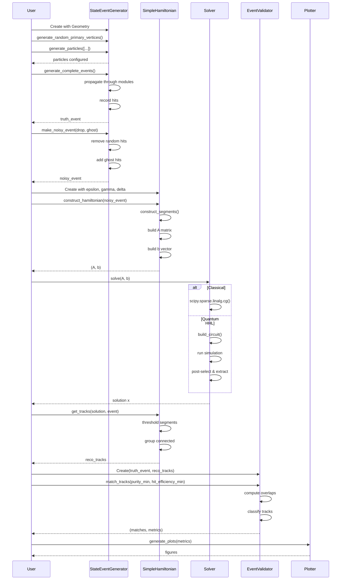

### Quantum Execution with Noise

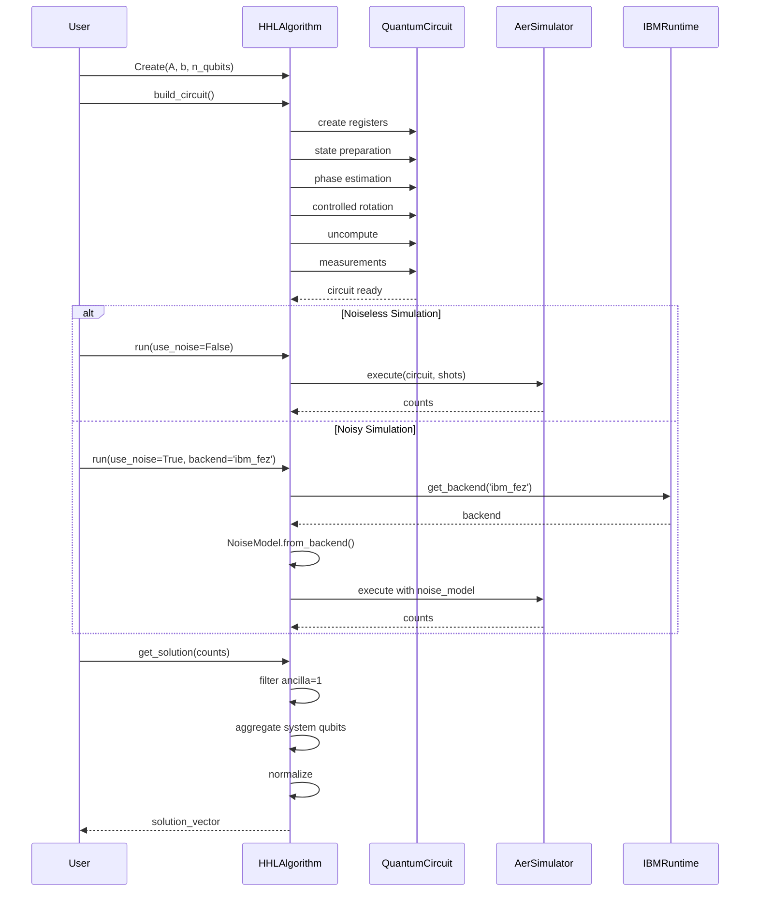

---

## State Machine: Track Matching (Non-Greedy)

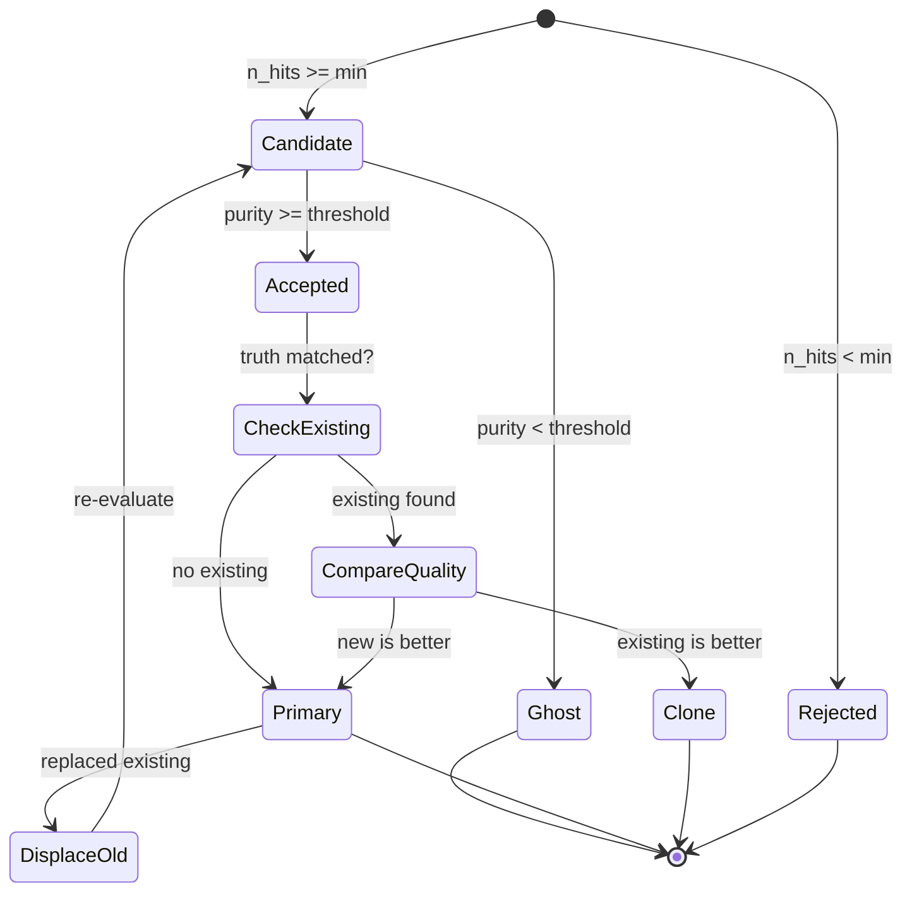

---

## Data Structures Summary

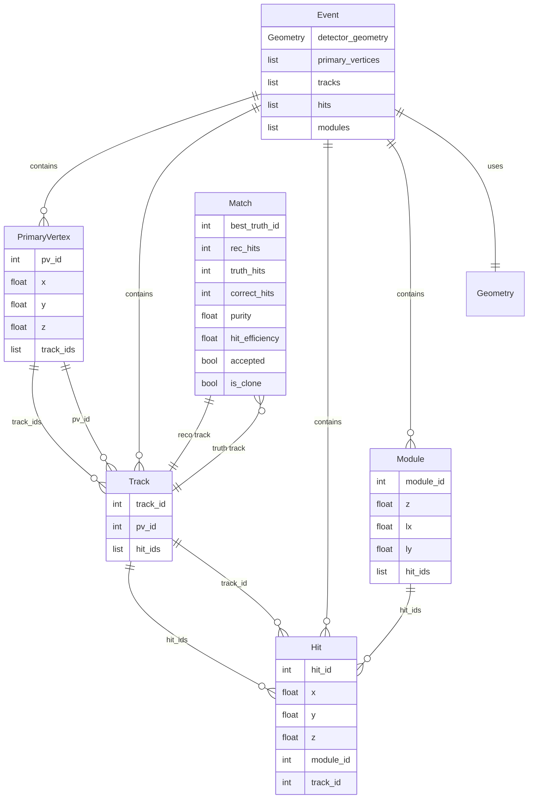

> **Note:** Segments are NOT stored in Events. They are computed on-demand
> using `get_segments_from_event()` from `solvers.reconstruction`.

---

## See Also

- [API_REFERENCE.md](API_REFERENCE.md) - Detailed class and method documentation
- [DEPENDENCIES.md](DEPENDENCIES.md) - Package dependencies
- [RESTRUCTURING_PROPOSAL.md](../RESTRUCTURING_PROPOSAL.md) - Package restructuring plan
