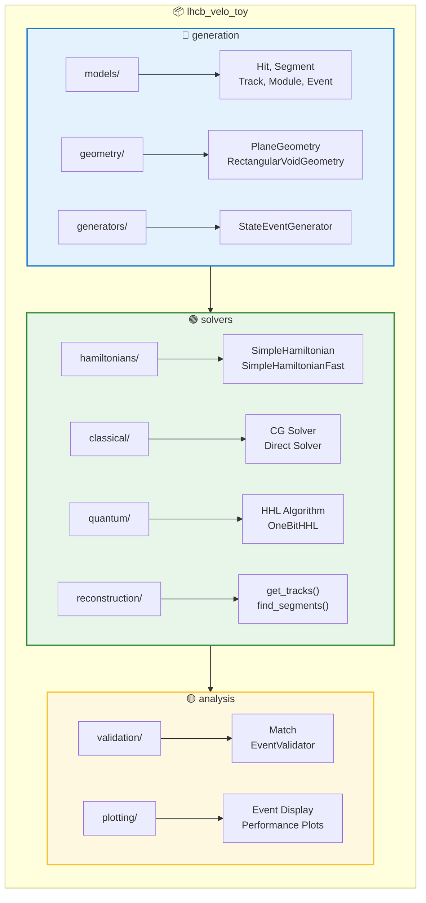
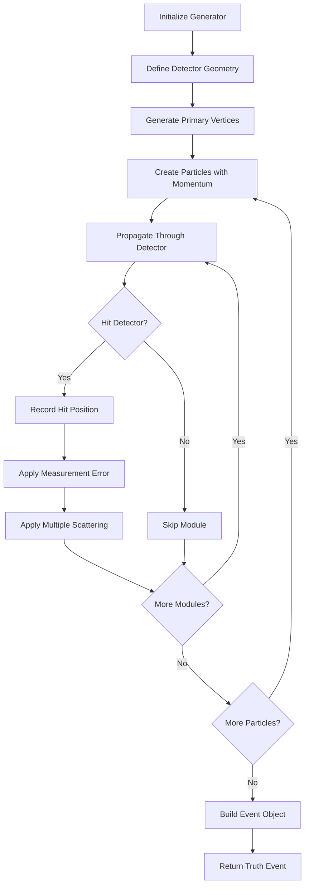
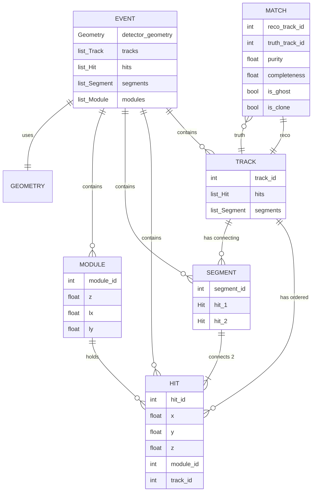

# LHCb VELO Toy Model - Workflow Overview

A comprehensive guide to understanding the architecture, data flow, and usage patterns of the LHCb VELO Toy Model package.

---

## Table of Contents

1. [Executive Summary](#executive-summary)
2. [Package Architecture](#package-architecture)
3. [Complete Workflow Pipeline](#complete-workflow-pipeline)
4. [Detailed Module Descriptions](#detailed-module-descriptions)
5. [Data Model Relationships](#data-model-relationships)
6. [Usage Examples](#usage-examples)

---

## Executive Summary

The **LHCb VELO Toy Model** is a simulation and reconstruction framework for particle tracking in the LHCb Vertex Locator (VELO) detector at CERN's Large Hadron Collider. The package provides:

| Component | Purpose |
|-----------|---------|
| **Event Generation** | Simulate particle collisions and detector responses |
| **Hamiltonian Solvers** | Formulate track reconstruction as an optimization problem |
| **Quantum Algorithms** | Explore HHL algorithm for linear system solving |
| **Validation Tools** | Measure reconstruction performance using LHCb metrics |

---

## Package Architecture

```
┌─────────────────────────────────────────────────────────────────────────────┐
│                         lhcb_velo_toy Package                               │
├─────────────────────────────────────────────────────────────────────────────┤
│                                                                             │
│  ┌─────────────────┐     ┌─────────────────┐    ┌─────────────────┐         │
│  │   🔵 GENERATION │───▶│   🟢 SOLVERS   │───▶│   🟡 ANALYSIS  │         │
│  │                 │     │                 │    │                 │         │
│  │ • Geometry      │     │ • Hamiltonians  │    │ • Validation    │         │
│  │ • Models        │     │ • Classical     │    │ • Plotting      │         │
│  │ • Generators    │     │ • Quantum       │    │                 │         │
│  │                 │     │ • Reconstruction│    │                 │         │
│  └─────────────────┘     └─────────────────┘    └─────────────────┘         │
│           │                     │                     │                     │
│           ▼                     ▼                     ▼                     │
│  ┌──────────────────────────────────────────────────────────────-───┐       │
│  │                       📦 core/types.py                          │       │
│  │    HitID, ModuleID, SegmentID, TrackID, Position, StateVector    │       │
│  └────────────────────────────────────────────────────────────────-─┘       │
│                                                                             │
└─────────────────────────────────────────────────────────────────────────────┘
```

### Three-Submodule Design



---

## Complete Workflow Pipeline

### High-Level Flow Diagram

```mermaid
flowchart LR
    subgraph "1️⃣ INPUT"
        direction TB
        CONFIG["⚙️ Configuration<br/>• Detector geometry<br/>• Particle definitions<br/>• Physics parameters"]
    end
    
    subgraph "2️⃣ GENERATION"
        direction TB
        GEN["🔵 StateEventGenerator<br/>• Create primary vertices<br/>• Propagate particles<br/>• Record hits"]
        EVT["📊 Event<br/>• Truth tracks<br/>• Hits on modules<br/>• Perfect segments"]
        NOISE["🔀 Add Noise<br/>• Drop rate<br/>• Ghost hits"]
        
        GEN --> EVT --> NOISE
    end
    
    subgraph "3️⃣ SOLVING"
        direction TB
        HAM["🟢 Hamiltonian<br/>• Build A matrix<br/>• Build b vector"]
        SOLVE{"Solver?"}
        CLASS["📐 Classical<br/>Conjugate Gradient"]
        QUANT["⚛️ Quantum<br/>HHL / OneBitHHL"]
        SOLN["📈 Solution x̄"]
        
        HAM --> SOLVE
        SOLVE --> CLASS
        SOLVE --> QUANT
        CLASS --> SOLN
        QUANT --> SOLN
    end
    
    subgraph "4️⃣ RECONSTRUCTION"
        direction TB
        THRESH["🎯 Threshold<br/>x̄ > cutoff"]
        GROUP["🔗 Group Segments<br/>Into tracks"]
        RECO["🛤️ Reconstructed<br/>Tracks"]
        
        THRESH --> GROUP --> RECO
    end
    
    subgraph "5️⃣ VALIDATION"
        direction TB
        MATCH["🟡 Match Tracks<br/>• Purity<br/>• Completeness"]
        METRICS["📊 Metrics<br/>• Efficiency<br/>• Ghost Rate<br/>• Clone Rate"]
        PLOTS["📈 Plots"]
        
        MATCH --> METRICS --> PLOTS
    end
    
    CONFIG --> GEN
    NOISE --> HAM
    SOLN --> THRESH
    RECO --> MATCH
    EVT -.->|"truth"| MATCH
```



### Detailed Step-by-Step Process

```
┌─────────────────────────────────────────────────────────────────────────────┐
│                        COMPLETE RECONSTRUCTION PIPELINE                     │
├─────────────────────────────────────────────────────────────────────────────┤
│                                                                             │
│  STEP 1: CONFIGURE DETECTOR GEOMETRY                                        │
│  ═══════════════════════════════════                                        │
│                                                                             │
│     PlaneGeometry                                                           │
│     ┌──────────────────────────────────────────────────────────────┐        │
│     │  Module 0    Module 1    Module 2   ...   Module N-1         │        │
│     │     │           │           │                 │              │        │
│     │  z=100mm    z=130mm     z=160mm    ...    z=z_max            │        │
│     │                                                              │        │
│     │  Each module: lx (half-width X), ly (half-width Y)           │        │
│     └──────────────────────────────────────────────────────────────┘        │
│                                                                             │
│                                  │                                          │
│                                  ▼                                          │
│                                                                             │
│  STEP 2: GENERATE PARTICLE EVENTS                                           │
│  ════════════════════════════════                                           │
│                                                                             │
│     StateEventGenerator                                                     │
│     ┌──────────────────────────────────────────────────────────────┐        │
│     │                                                              │        │
│     │   Primary Vertex (PV)                                        │        │
│     │         *                                                    │        │
│     │        /|\                                                   │        │
│     │       / | \                                                  │        │
│     │      /  |  \     ← Particles with momentum (tx, ty, p/q)     │        │
│     │     ●   ●   ●     ← Hits at each module crossing             │        │
│     │     │   │   │                                                │        │
│     │     ●   ●   ●     ← Measurement error applied                │        │
│     │     │   │   │                                                │        │
│     │     ●   ●   ●     ← Multiple scattering effects              │        │
│     │                                                              │        │
│     └──────────────────────────────────────────────────────────────┘        │
│                                                                             │
│     Output: Event containing:                                               │
│     • Truth tracks (T_1, T_2, ..., T_n)                                     │
│     • Hits on modules                                                       │
│     • Segments connecting adjacent hits                                     │
│                                                                             │
│                                  │                                          │
│                                  ▼                                          │
│                                                                             │
│  STEP 3: ADD REALISTIC NOISE (Optional)                                     │
│  ══════════════════════════════════════                                     │
│                                                                             │
│     make_noisy_event(drop_rate, ghost_rate)                                 │
│     ┌──────────────────────────────────────────────────────────────┐        │
│     │                                                              │        │
│     │   ● = Real hit                                               │        │
│     │   ○ = Dropped hit (random removal)                           │        │
│     │   ✕ = Ghost hit (random fake hit)                            │        │
│     │                                                              │        │
│     │     Before:  ●──●──●──●──●                                   │        │
│     │     After:   ●──○──●──●──●  +  ✕ ✕                           │        │
│     │                                                              │        │
│     └──────────────────────────────────────────────────────────────┘        │
│                                                                             │
│                                  │                                          │
│                                  ▼                                          │
│                                                                             │
│  STEP 4: CONSTRUCT HAMILTONIAN                                              │
│  ═════════════════════════════════                                          │
│                                                                             │
│     SimpleHamiltonian(ε, γ, δ)                                              │
│     ┌──────────────────────────────────────────────────────────────┐        │
│     │                                                              │        │
│     │   1. Build ALL possible segments between adjacent modules:   │        │
│     │                                                              │        │
│     │      Module i        Module i+1                              │        │
│     │         ●──────────────●                                     │        │
│     │         ●──────────────●     ← n_segs = hits_i × hits_{i+1}  │        │
│     │         ●──────────────●                                     │        │
│     │                                                              │        │
│     │   2. Build interaction matrix A (n_segs × n_segs):           │        │
│     │                                                              │        │
│     │      A_ij = 1  if segments i,j share endpoint AND            │        │
│     │                angle between them < ε (angular tolerance)    │        │
│     │                                                              │        │
│     │      A_ii = -(γ + δ)  (diagonal penalty)                     │        │
│     │                                                              │        │
│     │   3. Build bias vector b:                                    │        │
│     │                                                              │        │
│     │      b_i = γ + δ  (favor all segments equally)               │        │
│     │                                                              │        │
│     └──────────────────────────────────────────────────────────────┘        │
│                                                                             │
│                                  │                                          │
│                                  ▼                                          │
│                                                                             │
│  STEP 5: SOLVE LINEAR SYSTEM Ax = b                                         │
│  ══════════════════════════════════                                         │
│                                                                             │
│     ┌─────────────────────┬─────────────────────┐                           │
│     │   CLASSICAL         │   QUANTUM           │                           │
│     ├─────────────────────┼─────────────────────┤                           │
│     │                     │                     │                           │
│     │ scipy.sparse.linalg │  HHL Algorithm      │                           │
│     │ .cg(A, b)           │  ┌───────────────┐  │                           │
│     │                     │  │ |b⟩ state prep│  │                           │
│     │ Direct methods:     │  │ Phase Est.    │  │                           │
│     │ np.linalg.solve     │  │ Rotation      │  │                           │
│     │                     │  │ Uncompute     │  │                           │
│     │                     │  │ Measure       │  │                           │
│     │                     │  └───────────────┘  │                           │
│     │                     │                     │                           │
│     │                     │  OneBitHHL          │                           │
│     │                     │  (Simplified)       │                           │
│     │                     │                     │                           │
│     └─────────────────────┴─────────────────────┘                           │
│                                                                             │
│     Output: Solution vector x̄ where x̄_i ≈ 1 if segment i is real            │
│                                                                             │
│                                  │                                          │
│                                  ▼                                          │
│                                                                             │
│  STEP 6: RECONSTRUCT TRACKS                                                 │
│  ══════════════════════════                                                 │
│                                                                             │
│     get_tracks(hamiltonian, solution, event)                                │
│     ┌──────────────────────────────────────────────────────────────┐        │
│     │                                                              │        │
│     │   1. Apply threshold: keep segments where x̄_i > cutoff       │        │
│     │                                                              │        │
│     │   2. Group connected segments:                               │        │
│     │                                                              │        │
│     │      Segment A ──●── Segment B ──●── Segment C               │        │
│     │                  │                                           │        │
│     │                  └── shared endpoint → same track            │        │
│     │                                                              │        │
│     │   3. Output: List of reconstructed Track objects             │        │
│     │                                                              │        │
│     └──────────────────────────────────────────────────────────────┘        │
│                                                                             │
│                                  │                                          │
│                                  ▼                                          │
│                                                                             │
│  STEP 7: VALIDATE RECONSTRUCTION                                            │
│  ═══════════════════════════════                                            │
│                                                                             │
│     EventValidator(truth_event, reco_tracks)                                │
│     ┌──────────────────────────────────────────────────────────────┐        │
│     │                                                              │        │
│     │   For each reco track R_i, compare to each truth track T_j:  │        │
│     │                                                              │        │
│     │   • shared_hits = |R_i ∩ T_j|                                │        │
│     │   • purity = shared_hits / |R_i|                             │        │
│     │   • completeness = shared_hits / |T_j|                       │        │
│     │                                                              │        │
│     │   Classification:                                            │        │
│     │   ┌────────────────────────────────────────────────────┐     │        │
│     │   │ ACCEPTED: purity ≥ threshold                       │     │        │
│     │   │ GHOST:    purity < threshold (fake track)          │     │        │
│     │   │ CLONE:    same truth track matched multiple times  │     │        │
│     │   └────────────────────────────────────────────────────┘     │        │
│     │                                                              │        │
│     │   Metrics:                                                   │        │
│     │   • Efficiency = matched / reconstructible                   │        │
│     │   • Ghost Rate = ghosts / candidates                         │        │
│     │   • Clone Rate = clones / primaries                          │        │
│     │                                                              │        │
│     └──────────────────────────────────────────────────────────────┘        │
│                                                                             │
└─────────────────────────────────────────────────────────────────────────────┘
```

---

## Detailed Module Descriptions

### 🔵 Generation Module

The **generation** module creates simulated particle collision events that mimic real LHCb VELO detector data.

| Component | File | Description |
|-----------|------|-------------|
| **Hit** | `models/hit.py` | A measurement point (x, y, z) on a detector module |
| **Segment** | `models/segment.py` | A line connecting two adjacent hits |
| **Track** | `models/track.py` | A particle trajectory: ordered hits + segments |
| **Module** | `models/module.py` | A detector layer at fixed z position |
| **Event** | `models/event.py` | Container for all tracks, hits, segments, modules |
| **PlaneGeometry** | `geometry/plane.py` | Simple rectangular detector planes |
| **RectangularVoidGeometry** | `geometry/rectangular_void.py` | Planes with beam pipe hole |
| **StateEventGenerator** | `generators/state_event.py` | Main event simulation engine |

#### Event Generation Process



---

### 🟢 Solvers Module

The **solvers** module formulates track reconstruction as a **Quadratic Unconstrained Binary Optimization (QUBO)** problem and provides multiple solution methods.

#### Hamiltonian Formulation

The track-finding problem is encoded in a Hamiltonian:

$$H = -\sum_{i,j} A_{ij} x_i x_j + \sum_i b_i x_i$$

Where:
- $x_i \in \{0, 1\}$ indicates if segment $i$ is part of a real track
- $A_{ij}$ encodes **compatibility** between segments (share endpoint + small angle)
- $b_i$ is a **bias term** favoring segment activation

| Component | File | Description |
|-----------|------|-------------|
| **Hamiltonian** | `hamiltonians/base.py` | Abstract base class |
| **SimpleHamiltonian** | `hamiltonians/simple.py` | Reference implementation |
| **SimpleHamiltonianFast** | `hamiltonians/fast.py` | Optimized sparse version |
| **Classical Solvers** | `classical/solvers.py` | Conjugate gradient, direct |
| **HHL** | `quantum/hhl.py` | Full HHL quantum algorithm |
| **OneBitHHL** | `quantum/one_bit_hhl.py` | Simplified 1-qubit phase est. |
| **get_tracks** | `reconstruction/track_finder.py` | Extract tracks from solution |

#### Solver Comparison

| Solver | Complexity | Pros | Cons |
|--------|------------|------|------|
| **Direct** | O(n³) | Exact solution | Memory intensive |
| **Conjugate Gradient** | O(n²) | Sparse-friendly | Requires SPD matrix |
| **HHL** | O(log n) | Exponential speedup* | Circuit depth, noise |
| **OneBitHHL** | O(log n) | Simpler circuit | Lower precision |

*Theoretical quantum advantage for well-conditioned systems

---

### 🟡 Analysis Module

The **analysis** module evaluates reconstruction quality using standard LHCb tracking metrics.

| Component | File | Description |
|-----------|------|-------------|
| **Match** | `validation/match.py` | Single track-to-track match result |
| **EventValidator** | `validation/validator.py` | Full event validation engine |
| **Event Display** | `plotting/event_display.py` | 3D event visualization |
| **Performance Plots** | `plotting/performance.py` | Efficiency/ghost rate plots |

#### Validation Metrics

| Metric | Formula | Meaning |
|--------|---------|---------|
| **Purity** | `shared_hits / reco_hits` | Fraction of reco hits that are correct |
| **Completeness** | `shared_hits / truth_hits` | Fraction of truth hits that were found |
| **Efficiency** | `matched / reconstructible` | Track finding success rate |
| **Ghost Rate** | `ghosts / candidates` | Fake track rate |
| **Clone Rate** | `clones / primaries` | Duplicate track rate |

---

## Data Model Relationships



---

## Usage Examples

### Complete Workflow Example

```python
# ═══════════════════════════════════════════════════════════════════════════
# STEP 1: Import the package
# ═══════════════════════════════════════════════════════════════════════════
from lhcb_velo_toy import (
    # Generation
    PlaneGeometry, StateEventGenerator,
    # Solvers
    SimpleHamiltonian, get_tracks,
    # Analysis
    EventValidator,
)

# ═══════════════════════════════════════════════════════════════════════════
# STEP 2: Define detector geometry (10 modules along z-axis)
# ═══════════════════════════════════════════════════════════════════════════
geometry = PlaneGeometry(
    module_id=list(range(10)),
    lx=[50.0] * 10,              # Half-width in x (mm)
    ly=[50.0] * 10,              # Half-width in y (mm)
    z=[100 + i * 30 for i in range(10)]  # z positions (mm)
)

# ═══════════════════════════════════════════════════════════════════════════
# STEP 3: Create event generator
# ═══════════════════════════════════════════════════════════════════════════
particles = [[{'type': 'pion', 'mass': 139.6, 'q': 1}] * 5]  # 5 pions

generator = StateEventGenerator(
    detector_geometry=geometry,
    events=1,
    n_particles=[5],
    measurement_error=0.01,      # mm
    collision_noise=1e-3         # Multiple scattering
)

# ═══════════════════════════════════════════════════════════════════════════
# STEP 4: Generate event
# ═══════════════════════════════════════════════════════════════════════════
generator.generate_random_primary_vertices({'x': 0.01, 'y': 0.01, 'z': 50})
generator.generate_particles(particles)
truth_event = generator.generate_complete_events()

# ═══════════════════════════════════════════════════════════════════════════
# STEP 5: (Optional) Add noise
# ═══════════════════════════════════════════════════════════════════════════
noisy_event = generator.make_noisy_event(
    event=truth_event,
    drop_rate=0.05,    # 5% hit inefficiency
    ghost_rate=0.02    # 2% ghost hit rate
)

# ═══════════════════════════════════════════════════════════════════════════
# STEP 6: Build Hamiltonian
# ═══════════════════════════════════════════════════════════════════════════
hamiltonian = SimpleHamiltonian(
    epsilon=0.01,    # Angular tolerance (radians)
    gamma=1.0,       # Self-interaction penalty
    delta=1.0        # Bias term
)

A, b = hamiltonian.construct_hamiltonian(generator, convolution=False)

# ═══════════════════════════════════════════════════════════════════════════
# STEP 7: Solve (classical)
# ═══════════════════════════════════════════════════════════════════════════
solution = hamiltonian.solve_classicaly()

# ═══════════════════════════════════════════════════════════════════════════
# STEP 8: Extract reconstructed tracks
# ═══════════════════════════════════════════════════════════════════════════
reco_tracks = get_tracks(hamiltonian, solution, generator)
print(f"Reconstructed {len(reco_tracks)} tracks")

# ═══════════════════════════════════════════════════════════════════════════
# STEP 9: Validate results
# ═══════════════════════════════════════════════════════════════════════════
validator = EventValidator(
    truth_event=truth_event,
    reco_tracks=reco_tracks
)

metrics = validator.match_tracks(purity_threshold=0.75)
print(f"Efficiency: {metrics['efficiency']:.2%}")
print(f"Ghost Rate: {metrics['ghost_rate']:.2%}")

# ═══════════════════════════════════════════════════════════════════════════
# STEP 10: Visualize
# ═══════════════════════════════════════════════════════════════════════════
truth_event.plot_segments()
```

---

## Key Design Principles

1. **Modularity**: Three independent submodules that can be used separately
2. **Type Safety**: Comprehensive type hints and dataclasses throughout
3. **Extensibility**: Abstract base classes for custom geometries, Hamiltonians
4. **LHCb Compatibility**: Metrics and conventions match official LHCb tracking
5. **Quantum-Ready**: Structured to support quantum algorithm exploration

---

## See Also

- [API_REFERENCE.md](API_REFERENCE.md) - Detailed class documentation
- [FLOW_DIAGRAMS.md](FLOW_DIAGRAMS.md) - Additional Mermaid diagrams
- [DEPENDENCIES.md](DEPENDENCIES.md) - Package dependencies

---

*Last updated: January 2026*
