# LHCb VELO Toy Model - Documentation

Welcome to the documentation for the **LHCb VELO Toy Model** package—a comprehensive framework for simulating particle tracking in the LHCb Vertex Locator detector and testing track reconstruction algorithms, including quantum approaches using HHL.

---

## 📚 Documentation Index

### Core Documentation

| Document | Description |
|----------|-------------|
| [**API Reference**](API_REFERENCE.md) | Complete API documentation for all classes, methods, and functions |
| [**Flow Diagrams**](FLOW_DIAGRAMS.md) | Mermaid diagrams showing data flow, architecture, and class hierarchies |
| [**Dependencies**](DEPENDENCIES.md) | Package dependencies, I/O specifications, and requirements |

### Project Planning

| Document | Description |
|----------|-------------|
| [**Restructuring Proposal**](../RESTRUCTURING_PROPOSAL.md) | Proposed package restructuring into submodules |
| [**README**](../README.md) | Project overview, installation, and quick start |

---

## 🚀 Quick Links

### By Task

| I want to... | Go to... |
|--------------|----------|
| Generate simulated events | [StateEventGenerator API](API_REFERENCE.md#class-stateeventgenerator) |
| Understand data structures | [Data Models](API_REFERENCE.md#data-models) |
| Solve with classical methods | [Hamiltonians](API_REFERENCE.md#hamiltonians) |
| Use quantum HHL | [Quantum Algorithms](API_REFERENCE.md#quantum-algorithms) |
| Validate reconstruction | [EventValidator](API_REFERENCE.md#class-eventvalidator) |
| Create plots | [Plotting](API_REFERENCE.md#plotting) |
| See the full pipeline | [Full Pipeline Flow](FLOW_DIAGRAMS.md#data-flow-event-generation-to-validation) |
| Check dependencies | [Dependencies Matrix](DEPENDENCIES.md#dependency-matrix) |

### By Module

| Module | API Reference | Flow Diagram |
|--------|---------------|--------------|
| `generation` | [Data Models & Generators](API_REFERENCE.md#module-generation) | [Event Generation Flow](FLOW_DIAGRAMS.md#event-generation-flow) |
| `solvers` | [Hamiltonians & Algorithms](API_REFERENCE.md#module-solvers) | [Hamiltonian Flow](FLOW_DIAGRAMS.md#hamiltonian-construction-flow) |
| `analysis` | [Validation & Plotting](API_REFERENCE.md#module-analysis) | [Validation Flow](FLOW_DIAGRAMS.md#validation-flow) |

---

## 📦 Package Structure

```
lhcb_velo_toy/
├── generation/           # Data generation module
│   ├── models.py        # Hit, Segment, Track, Event, Module
│   ├── geometry.py      # Geometry, PlaneGeometry, RectangularVoidGeometry
│   └── generator.py     # StateEventGenerator, MultiScatteringGenerator
│
├── solvers/             # Solving algorithms
│   ├── hamiltonian.py   # Hamiltonian (ABC)
│   ├── classical.py     # SimpleHamiltonian, SimpleHamiltonianFast
│   ├── cpp_wrapper.py   # SimpleHamiltonianCPPWrapper
│   ├── hhl.py           # HHLAlgorithm
│   └── onebqf.py        # OneBQF (1-Bit Quantum Filter)
│
└── analysis/            # Analysis and validation
    ├── validator.py     # EventValidator, Match
    └── plotting.py      # LHCb-style performance plots
```

---

## 🔧 Installation

```bash
# Basic installation
pip install lhcb-velo-toy

# With quantum algorithms
pip install lhcb-velo-toy[quantum]

# Full installation
pip install lhcb-velo-toy[all]
```

See [DEPENDENCIES.md](DEPENDENCIES.md#installation-profiles) for detailed installation options.

---

## 📊 Example Pipeline

```python
from lhcb_velo_toy.generation import PlaneGeometry, StateEventGenerator
from lhcb_velo_toy.solvers import SimpleHamiltonian, get_tracks
from lhcb_velo_toy.analysis import EventValidator

# 1. Define detector geometry
geometry = PlaneGeometry(
    module_id=[1, 2, 3, 4, 5],
    lx=[50.0] * 5, ly=[50.0] * 5,
    z=[100.0, 130.0, 160.0, 190.0, 220.0]
)

# 2. Generate events
gen = StateEventGenerator(geometry, events=1, n_particles=[10])
gen.generate_random_primary_vertices({"x": 0.1, "y": 0.1, "z": 1.0})
particles = [[{"type": "MIP", "mass": 0.511, "q": 1} for _ in range(10)]]
gen.generate_particles(particles)
truth_event = gen.generate_complete_events()

# 3. Add noise
noisy_event = gen.make_noisy_event(drop_rate=0.05, ghost_rate=0.1)

# 4. Reconstruct tracks
ham = SimpleHamiltonian(epsilon=0.01, gamma=1.5, delta=1.0)
ham.construct_hamiltonian(noisy_event)
solution = ham.solve_classicaly()
reco_tracks = get_tracks(ham, solution, noisy_event)

# 5. Validate
validator = EventValidator(truth_event, reco_tracks)
matches, metrics = validator.match_tracks(purity_min=0.7)
print(f"Efficiency: {metrics['efficiency']:.1%}")
print(f"Ghost Rate: {metrics['ghost_rate']:.1%}")
```

---

## 📈 Visual Overview

```mermaid
graph LR
    subgraph Generation
        G[Geometry] --> GEN[Generator]
        GEN --> E[Event]
    end
    
    subgraph Solving
        E --> H[Hamiltonian]
        H --> S{Solver}
        S --> |Classical| CG[Conjugate Gradient]
        S --> |Quantum| HHL[HHL/OneBQF]
        CG --> X[Solution x̄]
        HHL --> X
    end
    
    subgraph Analysis
        X --> R[Reco Tracks]
        R --> V[Validator]
        E --> |Truth| V
        V --> M[Metrics]
        M --> P[Plots]
    end
    
    style Generation fill:#e3f2fd
    style Solving fill:#e8f5e9
    style Analysis fill:#fff8e1
```



---

## 📖 Further Reading

- **LHCb Collaboration**: [LHCb VELO Technical Design Report](https://cds.cern.ch/record/1621894)
- **HHL Algorithm**: [Harrow, Hassidim, Lloyd (2009)](https://arxiv.org/abs/0811.3171)
- **Quantum Track Finding**: [arXiv papers on quantum approaches to particle tracking]

---

## 🤝 Contributing

See [CONTRIBUTING.md](../CONTRIBUTING.md) for guidelines on contributing to this project.

---

## 📄 License

This project is licensed under the MIT License - see [LICENSE](../LICENSE) for details.
